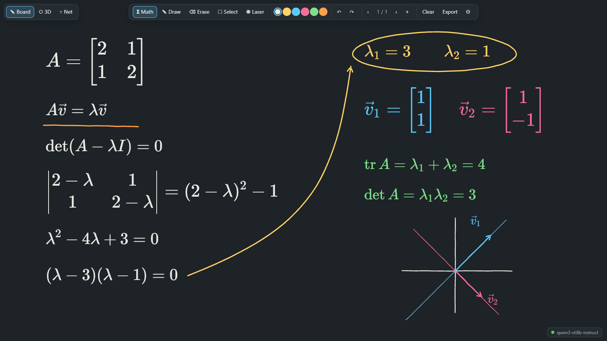
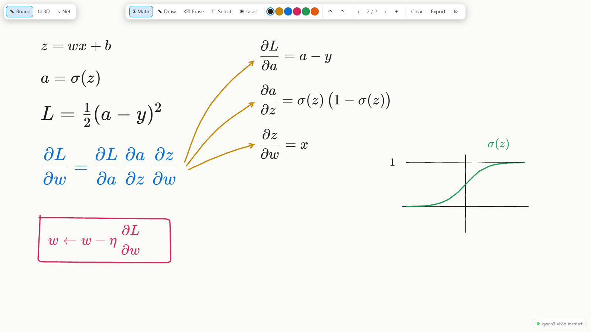
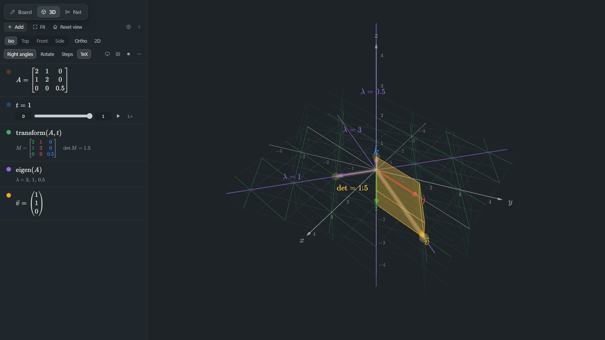
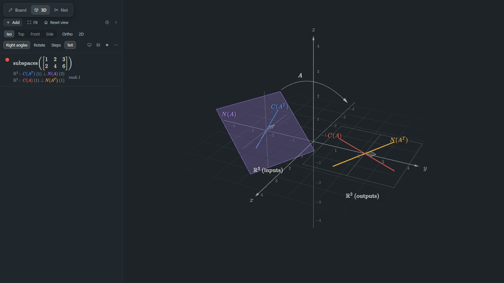
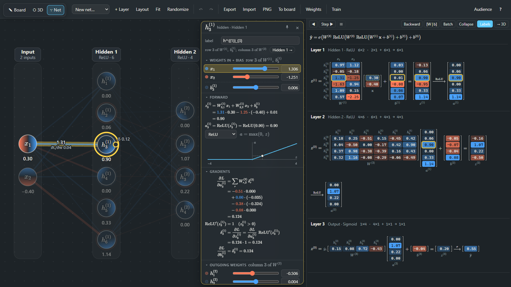
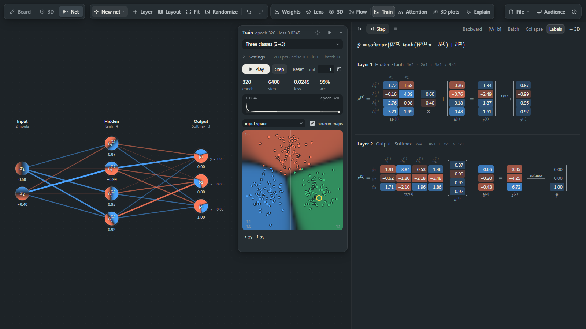
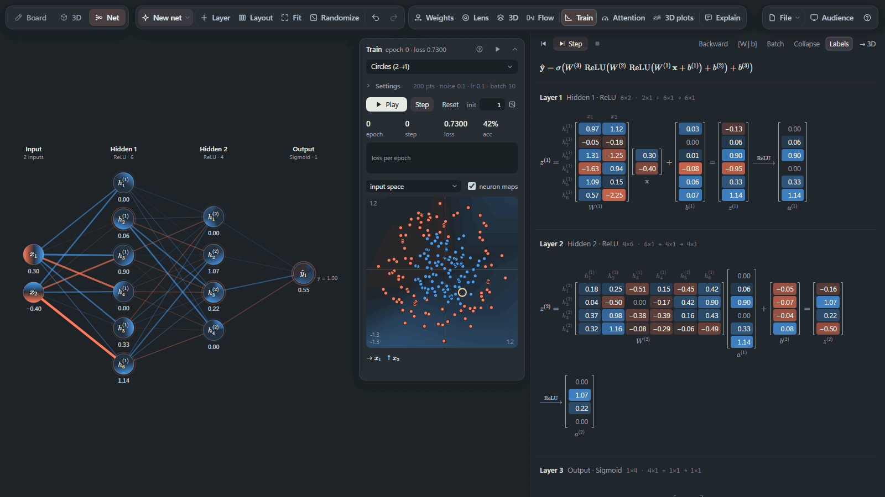

# Mathboard

[](https://github.com/mrcal17/mathboard/actions/workflows/test.yml)
[](LICENSE)



Mathboard is a whiteboard for teaching maths from a computer. You write with a pen or a mouse,
and a moment after you stop, each expression is replaced in place by typeset LaTeX. A vision
model reads the handwriting on your own GPU through [Ollama](https://ollama.com/), so nothing
you write is sent to a cloud service. Two more tabs cover what is slow to draw by hand: a 3D
linear-algebra grapher you drive by typing expressions, and a neural network you can edit, read
as matrix products and train live. It's a local web app with a standard-library Python server
and plain JavaScript. There is no build step and nothing to `npm install`.

- [Tour](#tour)
- [Quick start](#quick-start)
- [Requirements](#requirements)
- [Keyboard reference](#keyboard-reference)
- [Reference](#reference): [Board](#board-reference), [3D tab](#3d-tab-reference), [Net tab](#net-tab-reference)
- [How it works](#how-it-works)
- [Project layout](#project-layout)
- [Testing](#testing)
- [Credits and license](#credits-and-license)

## Tour

### Board



- The **Math pen** (M) groups nearby strokes into expressions. About 700 ms after you lift the
  pen, the expression goes to the model and comes back as KaTeX, sized to fit your handwriting.
- The **Draw pen** (D) is for arrows, boxes and sketches. It is never converted.
- Write next to typeset maths to extend it (`= 5` after `2 + 3`); the whole expression is read again.
- **Select** (S) an expression to edit its LaTeX, re-recognize it, copy it, turn it back into
  ink, delete it or send it to the 3D tab.
- Pages, undo, a laser pointer, a chalkboard and a whiteboard theme (T), and **H** to hide every
  control while you present. **Export** saves the converted maths as Markdown.

### 3D tab

<p>


</p>

Type one expression per row and the view redraws as you type. A row that names a number
(`a = 1.5`) becomes a slider with a play button, so anything can be animated.

```
u = (1, 2, 0)          # arrow from the origin
v = (-1, 1, 2)
a = 1.5                # a named number becomes a slider
b = 1
a u                    # implicit multiplication
b v @ a u              # drawn from the tip of a u: tip-to-tail
w = a u + b v
span(u, v)             # the plane they span, with the grid of integer combinations
```

Nine feature modules build on the vectors, matrices and spans. Five of them add linear algebra:
linear combinations laid out tip-to-tail with projections and intersections, animated
transformations (`transform(A, t)`), eigenlines and SVD, flows of dx/dt = Ax, row and column
pictures, animated Gauss-Jordan elimination, the four fundamental subspaces, Gram-Schmidt, and a
split domain/codomain view for non-square maps. The other four are for lecturing: saved
camera steps and a UI-free audience window, typeset rows with PNG snapshots and video recording,
a bridge that sends the view to the board and board maths to the 3D tab, and draggable vectors.
The left image above is `transform(A, t)` with `eigen(A)`; the right one is
`subspaces([[1,2,3],[2,4,6]])`.

### Net tab

<p>


</p>

An editable network for teaching. The canvas on the left and the matrix panel on the right show
the same numbers: each layer is written out as `z = W a + b`, and hovering a weight anywhere
lights it everywhere. Click a neuron, edge or layer for a card with its arithmetic and its
gradients. The Train panel fits the net to a toy dataset while you watch.



## Quick start

1. Install Ollama: <https://ollama.com/download>.
2. Pull the default recognition model:

   ```
   ollama pull qwen3-vl:8b-instruct
   ```

   Once loaded it takes about 6 GB of VRAM. If you skip this step, the server downloads the
   model on its first start.
3. Get Mathboard and start it:

   ```
   git clone https://github.com/mrcal17/mathboard.git
   cd mathboard
   start_mathboard.bat        # Windows
   python3 server.py          # macOS, Linux
   ```

The server runs on <http://127.0.0.1:8791>. If it finds Chrome or Edge (in the usual Windows
install folders, or `chrome` on the PATH), it opens the board in a chromeless app window, which is
easy to capture in OBS or share on a call. Otherwise it opens your default browser. The status
chip in the bottom-right corner turns green once the model is loaded. Ctrl+C in the console stops
the server and unloads the model.

**Other models.** Any Ollama model that can read images works:

```
python server.py --model qwen3-vl:4b-instruct
```

The server checks that the model has the vision capability and pulls it if it's missing. The
board's settings (⚙) also list your installed vision models and switch between them live.

| Option | Default | |
|---|---|---|
| `--model NAME` | `qwen3-vl:8b-instruct` (or `$MATHBOARD_MODEL`) | Ollama vision model |
| `--port N` | `8791` | |
| `--ollama URL` | `http://127.0.0.1:11434` (or `$MATHBOARD_OLLAMA`) | Ollama base URL |
| `--keep-alive T` | `30m` | how long Ollama keeps the model loaded when idle |
| `--tab` | | open a normal browser tab instead of an app window |
| `--no-browser` | | don't open anything |

`start_mathboard.bat` passes its arguments through, e.g. `start_mathboard.bat --model qwen3-vl:4b-instruct`.
If the port is already in use, Mathboard assumes it's already running and just opens the board.

**Only want the 3D and Net tabs?** They don't use the model. Without Ollama running,
`python server.py` still serves everything; the status chip stays red and handwriting stays as ink.

## Requirements

- **Python 3.8 or newer.** The server uses only the standard library.
- **Ollama** with a vision model, for the board. A GPU is recommended: on the author's
  machine each expression takes about a second.
- **A recent Chrome or Edge.** That's what Mathboard is developed and tested in. It needs ES
  modules with import maps, and WebGL 2 for the 3D tab. Firefox and Safari haven't been tested.
- **Node 22 or newer**, only to run the tests.

## Keyboard reference

Shortcuts are ignored while you type in a text field (the 3D row keys below are the exception).
**Alt+1 / Alt+2 / Alt+3** switch between the Board, 3D and Net tabs, and **H** hides the UI in
all three.

<table>
<tr><th>Board</th><th>3D tab</th><th>Net tab</th></tr>
<tr valign="top"><td>

| Key | |
|---|---|
| M | Math pen |
| D | Draw pen |
| E | Eraser |
| S | Select |
| L | Laser pointer |
| T | Chalkboard / whiteboard |
| N | New page |
| ← → | Previous / next page (also PageUp / PageDown) |
| Ctrl+Z | Undo |
| Ctrl+Y | Redo (also Ctrl+Shift+Z) |
| Esc | Close the open panel |

</td><td>

| Key | |
|---|---|
| 1 2 3 4 | Iso, Top, Front, Side view |
| O | Orthographic |
| R | Auto-rotate |
| ← → | Previous / next step (also PageUp / PageDown) |
| P | PNG snapshot |
| V | Start / stop recording |
| Enter | Add a row (while editing one) |
| ↑ ↓ | Move between rows |
| Backspace | Delete the row you're in if it's empty |
| Esc | Stop editing the row |

</td><td>

| Key | |
|---|---|
| Space | Play / pause training |
| T | One training step |
| S | Step through the matrices |
| Shift+S | Step back |
| B | Bias trick `[W \| b]` |
| W | Weight labels |
| F | Fit the net |
| Delete | Remove the selection |
| Esc | Close the cheat sheet, else deselect |
| ? | Cheat sheet |
| Ctrl+Z / Ctrl+Y | Undo / redo |

</td></tr>
</table>

**Mouse.** Board: right-drag or the pen's eraser end erases. 3D: left-drag rotates, right-drag
pans, the wheel zooms, and you can drag the head of a literal vector. Net: double-click empty
space to add a neuron or a layer, drag from the dot on a neuron's right edge to connect it, drag
empty space (or middle-drag anywhere) to pan, and use the wheel to zoom (Ctrl+wheel is faster).

## Reference

Everything below is the full manual. Each part is folded; open the one you need.

### Board reference

<details>
<summary>Pens, grouping, editing, pages, settings and export</summary>

| Key | |
|---|---|
| **M** | Math pen: grouped into expressions and converted |
| **D** | Draw pen: diagrams, arrows, circling things. Never converted |
| **E** | Eraser (also right-drag, or the pen's eraser end). Touching typeset reveals its handwriting so you can fix it |
| **S** | Select: tap an expression to edit its LaTeX / re-recognize / copy / keep as ink / delete / send to 3D; drag to move |
| **L** | Laser pointer |
| **H** | Hide all UI (clean view for the audience) |
| **T** | Chalkboard / whiteboard theme |
| **N**, **←/→** | New page, previous/next page (PageUp/PageDown work too) |
| **Ctrl+Z / Ctrl+Y** | Undo / redo (Ctrl+Shift+Z also redoes; Cmd works on a Mac). Undo is per page |

- **Grouping:** strokes that overlap or sit close together (about one symbol-gap sideways, a
  small gap vertically) form one expression. Leave a clear gap, or start a new line, for a new
  expression. A stroke that touches two expressions merges them. Drawing brackets around matrix
  entries merges the entries into one matrix. Tune with *Settings → Grouping reach*.
- **Converting:** an expression is sent once the pen has been idle on it for the *Convert after*
  delay (700 ms by default). A faint dashed outline marks expressions waiting their turn. A
  failed recognition is retried up to three times; after that the outline turns red.
- **Adding to an expression:** write next to converted typeset (e.g. `= 5` after `2 + 3`). The
  old typeset stays dimmed while the whole expression re-converts.
- **Select:** tap an expression to open its editor: **Apply** (Enter) your LaTeX edits,
  **Re-recognize**, **Copy**, **Send to 3D** (adds it to the 3D tab as a row, replacing a row that
  defines the same name), **Keep as ink** (plain ink that is never converted) or **Delete**. Drag
  to move expressions, Draw-pen strokes and pictures; drag a picture's bottom-right corner to
  resize it.
- **Colours:** the swatches in the toolbar set the colour of the pen you used last. Each theme has
  its own palette.
- **Pen input:** pressure changes the line width. Once a pen has been used, touch input is ignored,
  so your palm doesn't draw.
- **Settings (⚙):** *Model* (installed vision models, switched live), *Convert after*,
  *Grouping reach*, *Max typeset size*, *Handwriting after conversion* (hidden or faint), *Theme*,
  and *Erase all pages…*
- **Export** downloads the converted expressions of every page as Markdown, with `$$…$$` blocks
  in reading order (`mathboard-YYYY-MM-DD-HH-MM.md`). Draw-pen ink and pictures are left out.
- **Autosave:** the pages and settings are saved to the browser's local storage, so a refresh
  keeps your board. The undo history is not saved.

</details>

### 3D tab reference

<details>
<summary>Language: vectors, matrices, sliders and built-in functions</summary>

Top-left tabs switch between the board, the 3D grapher and the Net tab (Alt+1 / Alt+2 / Alt+3).
Type one expression per row; everything redraws as you type. Vectors start at the origin unless
you say otherwise with `@` (see the example in the [tour](#3d-tab)).

- **Vectors and points:** `(1, 2, 0)`, `point(x, y, z)`. A point minus a point is a vector; a point
  plus a vector is a point. `u.x` reads a component. Constants `i j k`, `pi` (or `π`) and `e`.
- **Products and lengths:** `dot`, `cross`, `u · v`, `u × v`, `|u|` (also `norm`, `length`,
  `mag`, `abs`), `unit` (also `normalize`), `proj(u, v)`, `angle(u, v)`, `deg`, `rad`.
- **Numbers:** `sin cos tan asin acos atan sqrt exp ln log` (base 10), `min`, `max`.
- **Shapes:** `span(u, v)`, `plane(n)`, `parallelogram(u, v)`, `parallelepiped(u, v, w)`.
- **Matrices:** `[[1,0,0],[0,2,0],[0,0,1]]` or `[1 0 0; 0 2 0; 0 0 1]` (rows; spaces separate
  entries, `;` rows), `matrix(u, v, w)` (columns), with `A u`, `det`, `inv`, `transpose` / `A^T`,
  and powers `A^n` including `A^-1`. `[1 2 3]` is a 1×3 row (`[1, 2, 3]` with commas is a vector),
  and a 2-3 entry column like `[1; 2; 3]` is a vector. `u^T` turns a vector into a row, so `u^T v`
  is a number, `u^T A u` is a number for a 3×3 `A`, and `u v^T` is an outer product.
- **Rows** can be referenced in any order. Comments start with `#` or `//`. The `?` button shows
  the cheat sheet.
- **Sliders:** a row that names a number (`a = 1.5`) becomes a slider with min/max boxes and a play
  button. The speed button cycles 1×, φ×, 2×, ½× and ¼×. Two sliders playing at 1× and φ× never
  repeat, so `trail(a u + b v)` gradually paints the patch of the span that the slider ranges cover
  (a trail keeps its last 3000 points). A slider passed as `t`, `k` or `n` to the functions below
  gets a matching range (0..1 for `transform(A, t)`, for example).
- **Rows panel:** Enter adds a row, Backspace on an empty row deletes it, ↑/↓ move between rows.
  The colour dot shows or hides a row, × deletes it, « folds the list away. **Fit** rescales the
  axes to fit everything and **Reset view** resets the camera.
- **Saving:** the rows (with colours and slider ranges and speeds), the axis extent and the folded
  list persist in local storage. The camera angle doesn't; a reload starts at the iso view.

</details>

<details>
<summary>Linear-algebra toolkit</summary>

Anything animated is driven by a slider variable: type `t = 0` and press its play button.

| Topic | Functions | Try |
|---|---|---|
| Linear combinations | `explain(A, v)` columns tip-to-tail · `chain(u, v, …)` · `trail(expr)` tip trail · `target(b, guess[, tol])` exercise, with a toast when you hit it | `target((1,5,2), a u + b v)` |
| Geometry | `arc` `shadow` `components` `crossview` `line(p, q)` `plane3(p, q, r)` `intersect` `distance`; right-angle marks, which the **∟ Right angles** button turns off | `shadow(u, v)` |
| Transformations | `transform(A, t)` and `transform(A, B, t)` (composition, t ∈ 0..2) morph the grid, basis and unit cube (det, orientation flip) and carry every other row along; `fixed(u)` opts out. Without `t` they show the end state. Singular matrices collapse their null space | `transform([[1,1],[0,1]], t)` |
| Eigen / SVD | `eigen(A)` eigenlines (glow when a carried vector stays on its span; complex pairs spiral) · `svdview(A[, t])` sphere → ellipsoid in stages, t ∈ 0..3 | `eigen(A)` with `transform(A, t)` |
| Dynamics / forms | `flow(A)` particles for dx/dt = Ax · `iterate(A, v, n)` · `power(A, v, n)` · `quadric(A[, c])` | `flow([[-0.3,-2],[2,-0.3]])` |
| Systems | `rowpicture(A, b)` · `colpicture(A, b)` · `eliminate(A, b[, k])` animated Gauss-Jordan · `lstsq(A, b)` · `solve(A, b)` | `eliminate(A, b, k)` |
| Subspaces / bases | `subspaces(A[, t])` four fundamental subspaces · `gramschmidt(u, v[, w][, k])` · `basis(b1, b2[, b3])` or `basis(M)` skewed grid · `coords(v, B)` | `subspaces([[1,2,3],[2,4,6]])` |
| Readouts | `rref` `rank` `nullspace` `colspace` `rowspace` `leftnull` `eig` `svd` `qr` `lu` `charpoly` `tr`. The four spaces are also drawn when they fit in 3D | `eig(A)` |
| Domain / codomain | `map(A)` splits the view into ℝⁿ and ℝᵐ, maps the grid and every vector, shows kernel, image and rank-nullity. With a 3×3 map, **Link cameras** ties the two views together | `map([[1,0],[0,1],[1,2]])` |

</details>

<details>
<summary>Presenting: views, steps, audience window, snapshots and recording</summary>

- **Keys** (ignored while typing): 1-4 view presets, O ortho, R auto-rotate, ←/→ or
  PageUp/PageDown steps, P snapshot, V record, H hide all UI. H is the same clean view as on the
  board, so it works in every tab.
- **Toolbar:** view presets Iso/Top/Front/Side, Ortho, Rotate, 2D mode, **Clear trails** and
  **∟ Right angles**.
- **TeX:** rows you aren't editing are typeset (column vectors, arrows on vector names).
- **PNG (P) / Rec (V):** snapshot or video of the 3D view with its labels. Recording prefers MP4
  (H.264) and falls back to WebM.
- **To board:** drops a snapshot onto the current board page. It can be moved and resized with Select.
- **Steps:** capture states (rows, slider values, camera, 2D mode, auto-rotate, folded list) as
  named steps. ←/→ fly between them and tween the sliders. Slider speeds aren't part of a step.
  Steps can be exported and imported as JSON (import replaces the current steps), so a lecture
  can be prepared ahead.
- **Audience:** opens a UI-free window (`index.html?audience=1`) that mirrors the presenter live.
  Put that window on the projector or in OBS. It is read-only: it never saves anything and never
  runs handwriting recognition.
- **Dragging:** grab the head of a literal vector or point (`(x, y, z)`, `[x, y, z]` with commas,
  or `point(…)`) to drag it. It moves in the horizontal plane; Shift moves it vertically (not in
  2D mode), and Alt turns off snapping to whole numbers.
- **Send to 3D:** on the board, tap a converted expression with Select and press **Send to 3D**
  in its editor to add its LaTeX to the 3D tab as a row.
- **Recordings look darker than the live view?** Chrome labels MP4 video as limited-range. Fix a
  file without re-encoding: `ffmpeg -i in.mp4 -c copy -bsf:v h264_metadata=video_full_range_flag=1 out.mp4`.
- **Browser storage:** board snapshots from the 3D tab are about 100 KB each. The board, the 3D
  list, the steps and the Net tab share the browser's ~5 MB, so after a few dozen snapshots,
  export your notes and clear old pages.
- **Links for testing:** `index.html#graph=<rows>&view=iso` opens the 3D tab with those rows
  (newline-separated, URI-encoded; `view` is `iso`, `top`, `front` or `side`) and doesn't save them.

</details>

### Net tab reference

<details>
<summary>Toolbar, keys and building the network</summary>

The third tab (**Net**, Alt+3) is an editable neural network for live teaching. The network is on
the left and the same numbers are on the right as matrix multiplication, `z = W a + b` per layer.
Drag the divider between them to resize the matrix panel. Double-click the divider, or drag it to
the right edge, to hide the panel; double-click again to bring it back. The first time, it opens on the XOR net.

| | |
|---|---|
| **New net…** | Start from a [preset](#presets) or **Blank**. Undoable |
| **+ Layer** | Inserts a fully connected hidden layer of 3 after the selected layer (or the selected neuron's layer, or just before the outputs), moving later columns right if there is no room. The direct edges between its neighbours are removed |
| **Layout**, **Fit** | Evenly spaced columns; zoom to fit |
| **Randomize** | New weights (He when a layer uses ReLU, Xavier otherwise) and biases back to 0. Shift+click gives small weights |
| **↶ ↷** | Undo / redo |
| **Export**, **Import** | The net as a `.json` file, training settings included. Import repairs what it can and is undoable |
| **PNG**, **To board** | Download a picture of the network, or drop it on the current board page (like the 3D tab's To board) |
| **Weights** | Numbers on the edges (W) |
| **Train** | Shows or hides the [Train panel](#train-panel) (open by default) |
| **Audience** | Opens the audience window, the same one as the 3D tab's |
| **?** | Cheat sheet: keys, tools and mouse gestures |

**Keys** (ignored while typing): Ctrl+Z / Ctrl+Y (or Ctrl+Shift+Z) undo / redo, Delete (or
Backspace) removes the selected neuron, edge or layer, Esc closes the cheat sheet or deselects,
F fits, H hides the UI, ? cheat sheet, W weight labels, S / Shift+S matrix step-through, B bias
trick, Space play / pause training, T one training step.

- **Building from Blank:** Blank is an empty input and output layer. Double-click empty space to
  add a neuron to the nearest layer. It is wired to every neuron of the neighbouring layers with
  random weights, and its row in `W` follows the picture, top to bottom. Double-click clearly
  between two columns to insert a one-neuron hidden layer (it takes over the edges between them,
  and later columns move right to make room), or beyond the first or last column to add a new
  input or output layer.
- **Connecting:** hover a neuron and drag from the dot on its right edge onto a neuron in another
  layer. The dashed line turns red over a neuron in the same layer; dropping on one that is
  already connected selects that edge. A target that isn't in a neighbouring layer makes a skip edge.
- **Deleting:** removing a hidden layer reconnects its neighbours. A net keeps at least two layers.
- **Moving:** drag a neuron (it snaps onto its column; Alt turns that off) or a layer header (the
  whole column). Positions are only the picture: moving never changes a neuron's row in `W`.
- **Pan / zoom:** drag empty space or middle-drag anywhere; mouse wheel to zoom (Ctrl+wheel is
  faster). Text grows as you zoom out so the numbers stay legible on a projector. F (or **Fit**)
  frames the net beside the Train panel; opening, folding or closing that panel refits by itself
  unless you have panned or zoomed.
- **Click** a neuron, edge or layer header to open its card; click empty space to deselect.
- **Colours:** blue is positive, orange negative, stronger means larger. A neuron's fill and the
  number under it are its activation (the input value on the input layer); an edge's colour and
  thickness are its weight. Output neurons show their target `y`. Once every output has a target
  the backward pass runs: each neuron gets a ring coloured and sized by δ = ∂L/∂z (the number
  shows on hover, on the selected neuron, or with W).
- **W:** the weight on every edge, with ∂L/∂w under it once targets are set. The hovered or
  selected edge always shows its numbers.
- **Hover** dims everything unrelated. Hovering in the matrix panel or a card lights the same
  neurons and edges here (a bias shows `b = …` beside its neuron), and the other way round.
- **Skip edges** (layer 0 → 2, say) bow around the columns they jump over and add their own
  `W a` term to the layer's sum.

</details>

<details>
<summary>Cards</summary>

A card opens next to whatever you click and follows the selection. **Pin** it to keep it open on
its target; the next click opens another card. Drag a card by its header, and double-click the
header to put it back. Section titles fold. Sliders: drag, type in the box, or double-click for 0;
each drag is one undo step. Hovering a row lights that weight or neuron everywhere.

| Card | Shows and edits |
|---|---|
| **Neuron** | Label (KaTeX) and where it sits (row of `W`, entry of `b`, column of the next `W`); incoming weights in column order, a missing one as "no edge: fixed 0" with **+ connect**, skip terms and the bias; the arithmetic `z = Σ w a + b` and `a = f(z)` with the real numbers; activation picker and a plot marking the current `(z, a)` (not for softmax); on outputs the target `y`, `a − y` and the loss; the gradients ∂L/∂z = ∂L/∂b and ∂L/∂a; outgoing weights; **Params**, free key/value notes (`$…$` renders as TeX). Input neurons get an input-value slider instead |
| **Edge** | Its entry `W_{i,j}` (row = target, column = source), a weight slider, its contribution `w·a` to `z`, the gradient ∂L/∂w = δ·a and the update `w − η ∂L/∂w` with the Train panel's rate, **remove edge** |
| **Layer** | Name; size **−** / **+** (a new neuron is wired like its neighbours); the shapes of `W` and `b` with masked and skip counts; activation picker with every neuron on the plot; **← connect previous** / **connect next →** (fills in missing edges); **randomize** this layer (xavier / he / small); the bias vector (input values on the input layer) with a slider per neuron |

</details>

<details>
<summary>Matrix panel and step-through</summary>

Each layer is written out as `z = W a + b → a` with the real numbers and the canvas's colours. A
missing edge is a faded, fixed 0, and skip edges add their own `W a` term. The formula on top
composes the whole network, and each layer's header gives the shapes (`3×2 · 2×1 + 3×1 → 3×1`).
Hover any cell, header or vector entry to light it on the canvas; click it to open its card.

| Toggle | |
|---|---|
| **Backward** | Backprop under every layer: the output δ for the loss in use, then δ = (Wᵀ δ) ⊙ σ'(z) going back, ∂L/∂W = δ aᵀ as an outer product, ∂L/∂b = δ, and the loss. Needs a target on every output |
| **[W \| b]** (B) | Bias trick: `b` becomes the last column of `W` and a 1 is appended to the input |
| **Batch** | `Z = W X + b 1ᵀ` with 4 samples as the columns of `X`: the Train panel's first points, or the current input and 3 made-up ones |
| **Collapse** | For an all-identity net, multiplies the layers into one `W_eff`, `b_eff` and checks it against ŷ. If only the output is nonlinear, everything inside it still collapses; a nonlinear hidden layer blocks it, and the panel shows why and what the net would give without activations |
| **Labels** | Row and column headers with the neuron labels (on by default) |

- **Step-through:** S (or **Step ▶** in the matrix panel's toolbar) walks the forward pass one row
  at a time. The row of `W`, its `b`, the input and the resulting `z_i`, `a_i` light up, the
  arithmetic appears under the layer, and on the canvas a pulse runs along that neuron's incoming
  edges. With targets set it carries on into the backward pass from the output layer (δ_i, a row
  of ∂L/∂W, ∂L/∂b_i), pulsing backwards along the outgoing edges. Shift+S (**◀**) steps back and
  **■** stops. If you switched **Backward** on yourself, S starts at the backward pass. Stepping
  turns Batch off.
- **→ 3D:** a layer whose `W` is at most 3×3 can be sent to the 3D tab, from the button in its
  header or the one in the matrix panel's toolbar (the selected layer, else the first that fits).
  A square `W` arrives as `W1 = [[…]]`, the layer's input as a vector (`a0 = (…)` for the first
  layer) and `transform(W1, t)` with a slider `t`; a non-square one with `map(W1)`; a single row
  or column as a vector. Skip terms aren't sent. Collapse can send `W_eff` too. Sending again
  updates the same rows.

</details>

<a name="train-panel"></a>
<details>
<summary>Train panel</summary>

**Train** opens a floating panel. Drag it by its title bar, double-click the title bar to put it
back, and ▾ folds it (the folded header still shows the epoch, the loss and a play button).

- **Data:** XOR, circles, spiral, two blobs, moons (2 inputs → 1 class), three classes (2 → 3,
  one-hot), line and sine (1 → 1, regression), with **points**, **noise** and **seed**. A preset
  picks the dataset that suits it. If the net's inputs and outputs don't match the dataset,
  **Adapt network** resizes the input and output layers (hidden layers are kept) and sets a
  matching output activation and loss; until then Play and Step are disabled.
- **Settings:** **loss** (MSE / x-entropy), **rate**, **batch** (1 to 128, or all) and
  **speed** (training steps per frame).
- **Play** (Space) trains live, **Step** (T) does one mini-batch step, **Reset** re-draws the
  weights from the **init** seed (biases back to 0) and **↻** picks a new seed first. A training
  run is one undo step. If the loss blows up, training pauses.
- **Readout:** epoch, step, the loss over the whole dataset, accuracy for classification, and a
  loss-per-epoch chart.
- **Plot:** with 2 inputs, the data over the network's decision regions; with 1 input, the data
  and the fitted curve. **plot** can instead pick a hidden layer with exactly 2 neurons: the data
  in that layer's activation space, with the input grid bent by the net. The yellow ring is the
  current input (with 1 input, a dashed yellow line). Hover a point for its values; click it to
  load it as the current input and target, so the canvas, cards and matrices show that sample.
- **neuron maps:** each neuron shows its activation over the whole input space inside its circle
  (a heatmap for 2 inputs, a curve for 1).
- The settings and the loss history are saved in the net, so export and undo keep them.

</details>

<a name="presets"></a>
<details>
<summary>Presets (37, in 7 groups)</summary>

**Basics**

| Preset | Net | Dataset | What to notice |
|---|---|---|---|
| Logic gates: AND, OR, NAND (hand-set) (`gates`) | 2 → 3 Sigmoid | none | Each row of W is one gate. Weights (20, 20) with bias −30 make AND, with −10 OR; flipping every sign gives NAND. The bias sets how many inputs must be on. |
| XOR by hand: OR + NAND, then AND (`xor_gates`) | 2 → 2 Sigmoid → 1 Sigmoid | none | Row 1 of W⁽¹⁾ is OR and row 2 is NAND; W⁽²⁾ ANDs them. That is XOR with no training: try all four 0/1 inputs. |
| XOR by hand: two ReLUs (exact) (`xor_relu`) | 2 → 2 ReLU → 1 | none | Both rows of W⁽¹⁾ are (1, 1); only the biases differ (0, −1). ReLU sends (0,1) and (1,0) to the same hidden point, so the linear output h₁ − 2h₂ is exactly XOR. |
| XOR (2-4-1) (`xor`) | 2 → 4 tanh → 1 Sigmoid | XOR | No single line separates XOR, so W⁽¹⁾ first maps the plane to 4 tanh features, where one row of W⁽²⁾ is enough. Train it and watch the boundary bend. |
| Perceptron (`perceptron`) | 2 → 1 Sigmoid | Two blobs | One neuron is one row of W: σ(w·x + b). The boundary is the line w·x + b = 0, with w as its normal. The same model as logistic regression. |
| Logistic regression (from w = 0) (`logreg`) | 2 → 1 Sigmoid | Two blobs | p = σ(w·x + b), starting at w = 0 (p = ½ everywhere). The loss is convex, so zero is a fine start: train and watch w turn to point from blob 0 to blob 1. |
| Linear regression (1 → 1) (`linreg`) | 1 → 1 | Line | W is 1×1: ŷ = w x + b. From w = b = 0, gradient descent walks to the least-squares line, slope 0.7 and intercept 0.2. |
| Softmax regression (2 → 3) (`softmax_reg`) | 2 → 3 Softmax | Three classes | W is 3×2, one row per class: z_k = w_k·x + b_k, and softmax turns the scores into probabilities. The class boundaries are where two rows tie. Starts at W = 0. |
| Linear (collapses to one matrix) (`linear`) | 2 → 3 → 2 | none | No activations, so the layers collapse: W⁽²⁾W⁽¹⁾ is a single 2×2 matrix (Collapse in the matrix panel). Depth adds nothing without a nonlinearity. |

**MLPs**

| Preset | Net | Dataset | What to notice |
|---|---|---|---|
| MLP (2-6-4-1, ReLU) (`mlp`) | 2 → 6 ReLU → 4 ReLU → 1 Sigmoid | Circles | W⁽¹⁾ is 6×2, W⁽²⁾ 4×6, W⁽³⁾ 1×4. Each first-layer ReLU creases the plane along a line; together the creases can enclose the inner circle. |
| Deep (4 hidden layers) (`deep`) | 2 → 6 tanh → 6 tanh → 6 tanh → 6 tanh → 1 Sigmoid | Spiral | Four tanh layers of 6, so the middle W's are 6×6. Each layer warps what the one before produced; the spiral takes many warps to untangle. |
| Classifier (2-4-3 softmax) (`classifier`) | 2 → 4 tanh → 3 Softmax | Three classes | The output W is 3×4, one row per class, and softmax turns the three scores into a distribution. With cross-entropy the output δ is just ŷ − y. |
| Wide & shallow (2-12-1) (`wide`) | 2 → 12 tanh → 1 Sigmoid | Circles | One hidden layer: W⁽¹⁾ is 12×2 and W⁽²⁾ 1×12, 49 parameters in all. Narrow & deep has exactly as many; train both on Circles and compare. |
| Narrow & deep (2-3-3-3-3-1) (`narrow_deep`) | 2 → 3 tanh → 3 tanh → 3 tanh → 3 tanh → 1 Sigmoid | Circles | Four hidden layers of 3: W is 3×2, then three 3×3, then 1×3, 49 parameters like Wide & shallow. Depth composes functions instead of adding more of them. |
| Funnel classifier (2-8-6-4-3) (`funnel`) | 2 → 8 ReLU → 6 ReLU → 4 ReLU → 3 Softmax | Three classes | W shrinks down the chain, 8×2, 6×8, 4×6, 3×4: each layer maps into a smaller space, ending in the 3 class scores. |
| Universal approximation (1-10-1, hand-built) (`uat`) | 1 → 10 ReLU → 1 | Sine | Built by hand: unit i is ReLU(x − kᵢ) with knots kᵢ = −1, −0.8, …, 0.8 (W⁽¹⁾ all 1s, b⁽¹⁾ = −k). W⁽²⁾ holds the slope changes, so ŷ joins the sine's values at the knots. |

**Skip connections**

| Preset | Net | Dataset | What to notice |
|---|---|---|---|
| Residual block (skip edges) (`residual`) | 2 → 3 ReLU → 2 → 1 Sigmoid | Moons | The x + F(x) layer has two terms: W⁽²⁾a⁽¹⁾ plus the identity shortcut from x (off-diagonal masked). The gradient reaches x through that identity unchanged. |
| ResNet bottleneck block (`bottleneck`) | 2 → 4 ReLU → 2 ReLU → 2 ReLU → 4 ReLU → 1 Sigmoid | Moons | Reduce 4 → 2, transform 2 → 2, expand 2 → 4, then add the stem a⁽¹⁾ through an identity term before the ReLU: a⁽⁴⁾ = ReLU(W⁽⁴⁾a⁽³⁾ + a⁽¹⁾ + b). |
| Transformer FFN block (d → 4d → d) (`ffn`) | 2 → 8 ReLU → 2 → 1 Sigmoid | Circles | W⁽¹⁾ is 8×2 (d → 4d) and W⁽²⁾ 2×8 (4d → d); layer 2 also adds x through an identity term, so it holds x + FFN(x), the residual stream. A sigmoid head reads it. |
| DenseNet-style (every layer to every later one) (`densenet`) | 2 → 3 ReLU → 3 ReLU → 1 Sigmoid | Moons | Every layer has a term from every earlier layer: z⁽³⁾ = W⁽³⁾a⁽²⁾ + W a⁽¹⁾ + W x + b. That is DenseNet's concatenation [x; a⁽¹⁾; a⁽²⁾] times one wide matrix, split into blocks. |
| U-Net-style encoder-decoder skips (`unet`) | 4 → 3 ReLU → 2 ReLU → 3 ReLU → 4 | none | Mirror-image skips, encoder to decoder and input to output, each a masked identity, so detail can bypass the 2-unit bottleneck. U-Net concatenates instead, which would make them full blocks. |
| Wide & deep (linear + MLP) (`wide_deep`) | 2 → 4 ReLU → 4 ReLU → 1 Sigmoid | Moons | The output adds two terms before one sigmoid: W⁽³⁾a⁽²⁾ from the deep MLP and W x straight from the inputs, a plain linear model (the wide part). |

**Structure in W**

| Preset | Net | Dataset | What to notice |
|---|---|---|---|
| 1D convolution (banded W) (`conv1d`) | 8 → 6 | none | W is banded Toeplitz: every row is the kernel (−1, 2, −1) moved one column right, and everything off the band is masked. The box input lights up only at its two edges. |
| 1D convolution, stride 2 (`conv1d_s2`) | 9 → 4 | none | Stride 2: every row is the kernel (¼, ½, ¼) moved two columns right, so W is 4×9 and the signal comes out half as long. |
| Average pooling (fixed weights) (`avgpool`) | 8 → 4 | none | Each row of W is ½, ½ over its own pair of inputs, masked elsewhere: pooling is a fixed linear map. |
| Max pooling from ReLUs (exact) (`maxpool`) | 4 → 2 ReLU → 2 | none | max(a, b) = b + ReLU(a − b): the rows of W⁽¹⁾ take differences (1, −1), and the output adds b back through a skip term. Exact, with no max anywhere in the model. |
| Tiny LeNet: conv, pool, dense, softmax (`lenet`) | 8 → 6 ReLU → 3 → 3 Softmax | none | Three kinds of W in one net: the conv is banded (kernel ½, 1, ½), the pool is fixed ½ pairs, the last is dense. A bump in the middle of the 8 pixels comes out as mid. |
| Graph convolution (W = adjacency) (`gnn`) | 5 → 5 ReLU → 5 ReLU | none | W is the graph: row i averages node i and its neighbours (A + I, each row divided by its count) and every non-edge is masked. Two layers are two hops: node 1's signal reaches node 4, not 5. |
| Two towers (block-diagonal W) (`towers`) | 2 → 6 tanh → 4 tanh → 1 Sigmoid | Circles | W⁽¹⁾ and W⁽²⁾ are block-diagonal: tower A sees only x₁, tower B only x₂, and the output adds them. f(x₁) + g(x₂) can still fit Circles, since x₁² + x₂² is a sum too. |
| Multi-task: shared trunk, 3 heads (`multitask`) | 2 → 4 tanh → 6 tanh → 3 Sigmoid | Three classes | W⁽¹⁾ is the trunk every task shares; W⁽³⁾ is block-diagonal, so each sigmoid reads only its own head. Three yes/no tasks (is it class k?) train on one summed loss. |

**Sequences**

| Preset | Net | Dataset | What to notice |
|---|---|---|---|
| RNN unrolled over 4 steps (`rnn`) | 4 → 2 tanh → 2 tanh → 2 tanh → 2 tanh → 1 | none | Step t computes tanh(W_hh h⁽ᵗ⁻¹⁾ + w_x x_t + b), with x_t on a skip edge. Every step starts with the same W_hh and w_x, but there is no weight tying: training would move each copy on its own. |
| Dilated causal conv (WaveNet-style) (`wavenet`) | 8 → 8 → 8 → 8 | none | Each W is lower-triangular with ½ on the diagonal and ½ at offset 1, 2, then 4: no row reads the future, and the receptive field doubles per layer. The last output is the mean of all 8 inputs. |

**Embeddings & autoencoders**

| Preset | Net | Dataset | What to notice |
|---|---|---|---|
| Autoencoder (4-2-4) (`autoencoder`) | 4 → 2 tanh → 4 Sigmoid | none | W⁽¹⁾ (2×4) squeezes the 4 inputs into a 2-number code and W⁽²⁾ (4×2) rebuilds them. The target is the input itself. |
| Word embedding (one-hot lookup) (`embedding`) | 5 → 2 → 5 Softmax | none | x is one-hot, so W⁽¹⁾x is just the cat column of W⁽¹⁾: an embedding is a table lookup. W⁽²⁾ starts as W⁽¹⁾ᵀ, so each score is a dot product with the cat vector. |
| Linear autoencoder = PCA (3-2-3) (`pca_ae`) | 3 → 2 → 3 | Flat cloud (3-D) | All linear, so x̂ = W⁽²⁾W⁽¹⁾x + b has rank 2. Train on the flat cloud: the two columns of W⁽²⁾ come to span its plane, the span of the top two principal components. |

**Teaching demos**

| Preset | Net | Dataset | What to notice |
|---|---|---|---|
| Vanishing gradients (sigmoid chain) (`vanishing`) | 1 → 1 Sigmoid → 1 Sigmoid → 1 Sigmoid → 1 Sigmoid → 1 Sigmoid → 1 | Line | Turn on Backward: each sigmoid multiplies δ by w·σ′(z) ≤ ¼, so ∂L/∂W shrinks about 4× per layer toward the input. Train on Line: the early layers barely move. |
| GAN as one net: D(G(z)) (`gan`) | 2 → 4 ReLU → 2 → 4 ReLU → 1 Sigmoid | none | Only the composition D(G(z)). With target 1 the backward pass is G's update (fool D); a real GAN also shows D real data and trains D and G in turns. |

Every preset comes with an input and targets, so the backward pass shows at once, and always
builds the same weights. **Randomize** (or **↻** in the Train panel) gives new ones. The
New net menu groups them the same way, shows each note as a tooltip, and flashes it when the
preset loads. A preset marked "none" has no dataset of its own: the Train panel picks one
that fits its shape, or offers **Adapt network**.

</details>

<details>
<summary>Saving, audience window and H</summary>

- **Saving:** the net (training settings included), the panel width and whether the matrix panel
  is hidden autosave to local storage (`mathboard.nn`; the Train panel's open, folded and position
  state is in `mathboard.nn.train`), and the app reopens on the tab you left.
- **Audience window:** opened from the Net or the 3D toolbar, it follows you into the Net tab and
  mirrors the net (training included), the selection and its card, hover, the step-through, W
  labels, the matrix toggles and the matrix panel width live. It fits the net to its own size.
  The Train panel shows read-only and follows yours open or folded; its position and pinned cards
  are not mirrored. It never saves. While you are on the board it shows the 3D view.
- **H** shows your window the way the audience sees it: the tab bar, the toolbar, the cheat sheet,
  the matrix toolbar, the → 3D buttons and the connect dots go, and the divider is locked; cards
  stay up without their pin, close and "+ add" buttons (they still work), and the Train panel
  keeps its readout, chart and plot but hides its settings and buttons. Press H again (or
  Alt+1/2/3) to get around.
- **Links for testing:** `index.html#nn=xor` (or another preset key, such as `mlp` or `deep`) or
  `#nn=<base64url JSON>` opens the Net tab with that net. The net and the last tab aren't saved from such a link. `#graph=` wins if both are given.

</details>

## How it works

**Board.** `static/app.js` groups Math-pen strokes into expressions by bounding-box proximity.
When an expression has been idle for the *Convert after* delay and the pen is up, it is
rasterized black-on-white (longest side at most 768 px) and POSTed to `server.py`, which forwards
it to Ollama's `/api/chat` with a transcription prompt at temperature 0. The reply is stripped of
code fences and math delimiters, obvious matrix misreads (a hand-drawn 1 read as a bracket) are
fixed, and the result is rendered with KaTeX, scaled to fit the handwriting's bounding box. Every
edit bumps the expression's version, so stale results are dropped.

**Server.** `server.py` is standard-library Python. It serves the UI on 127.0.0.1, loads the model
at startup (pulling it if missing), keeps it resident while a board is open, and logs every
recognition with its latency to the console. It also keeps the last 40 images it sent to the model
and the raw replies in `debug/`, for diagnosing misreads. That folder holds your handwriting, stays
on your disk and is ignored by git.

**3D tab.** `static/graph/lang.js` parses and evaluates the rows, `linalg.js` is the numeric core,
`scene.js` draws with three.js, and `grapher.js` runs the expression list and hands a feature API
to the modules in `features/`, one per feature. They load in a fixed order and a broken one
doesn't take the others down. See [docs/FEATURE_GUIDE.md](docs/FEATURE_GUIDE.md).

**Net tab.** Everything lives in `static/nn/` as plain ES modules, and
[docs/NN_CONTRACT.md](docs/NN_CONTRACT.md) is the binding interface between them. `model.js`
holds the pure maths, edits, presets and datasets, and `store.js` the shared state, undo, events
and colours. `nn.js` is the shell (layout, toolbar, keys, persistence, module loading, and the
mirror API that `graph/features/lecture.js` carries to the audience window). It loads `view.js`
(the canvas), `inspector.js` (the cards), `matrix.js` (the matrix panel and step-through) and
`train.js` (datasets, training and plots), each with its own CSS and isolated so a broken one
doesn't take the others down.

## Project layout

```
server.py              HTTP server and Ollama bridge (standard library only)
start_mathboard.bat    Windows launcher; passes its arguments to server.py
static/
  index.html           the page with all three tabs
  app.js, style.css    the board
  graph/               3D tab: lang.js, linalg.js, scene.js, grapher.js
    features/          transform, fields, combos, systems, dual, lecture, present, bridge, drag
  nn/                  Net tab: model.js, store.js, nn.js, view.js, inspector.js, matrix.js, train.js
  vendor/              KaTeX 0.16.47 and three.js r186, with their licenses
tests/                 node:test suites, plus draw_test.js (see Testing)
docs/
  FEATURE_GUIDE.md     how 3D feature modules plug in, and the browser test recipe
  NN_CONTRACT.md       interfaces between the Net tab modules
  media/               the images in this README
```

## Testing

```
npm test               # same as: node --test "tests/*.test.mjs"
```

The suites cover the 3D language and numeric core, the pure logic of each 3D feature module, and
the Net tab's model (maths, edits, presets and datasets). They need Node 22 or newer and nothing
else. GitHub Actions runs them on every push and pull request, along with
`python -m py_compile server.py`.

For checks in a real browser, [docs/FEATURE_GUIDE.md](docs/FEATURE_GUIDE.md) has a Python
Playwright recipe that serves `static/` on its own port, so it doesn't need the model. It also
describes how the images in `docs/media/` were made. `tests/draw_test.js` is an end-to-end check
for Playwright's `browser_run_code`: it draws digits with the mouse on a running board and reports
what each expression became, so it needs the server and the model.

## Credits and license

- [KaTeX](https://katex.org/) typesets the maths and [three.js](https://threejs.org/) draws the
  3D view. Both are vendored under the MIT License; see [THIRD_PARTY_NOTICES.md](THIRD_PARTY_NOTICES.md).
- [Ollama](https://ollama.com/) runs the recognition model, by default
  [Qwen3-VL](https://ollama.com/library/qwen3-vl) from the Qwen team.
- The 3D tab's expression list takes its cue from [Desmos](https://www.desmos.com/3d).

Mathboard is released under the [MIT License](LICENSE).
